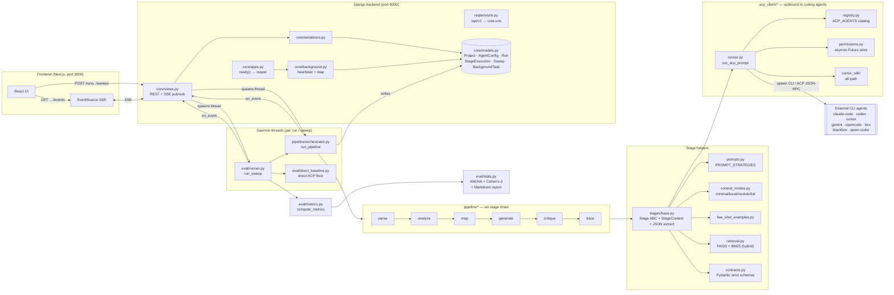
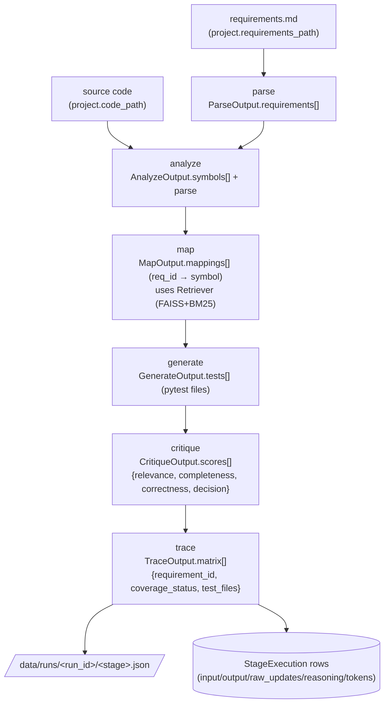
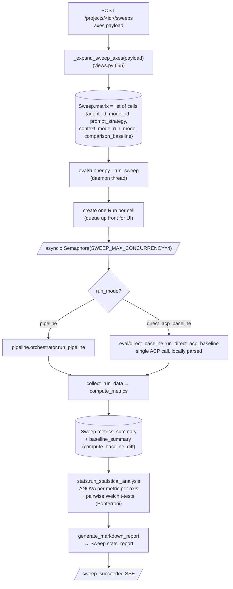
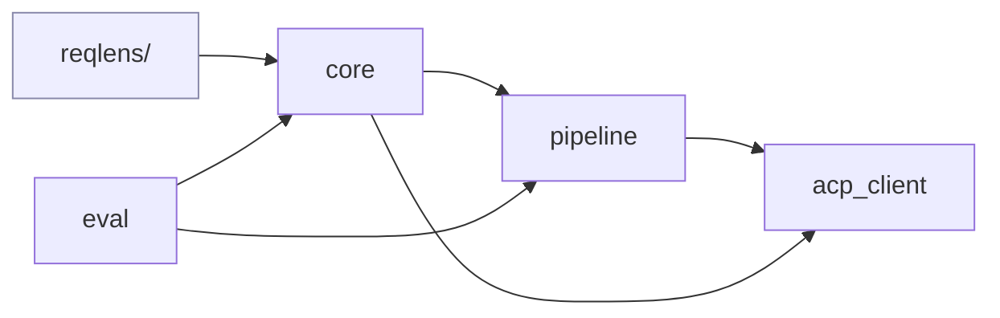
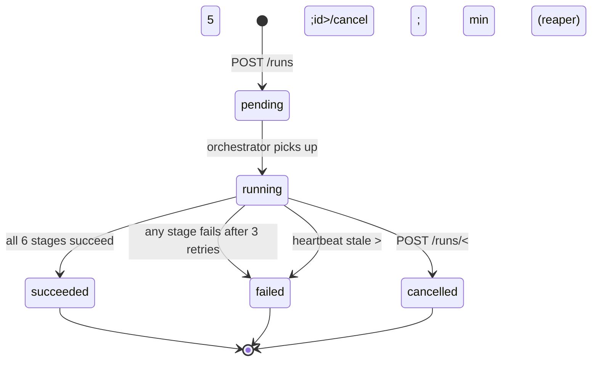
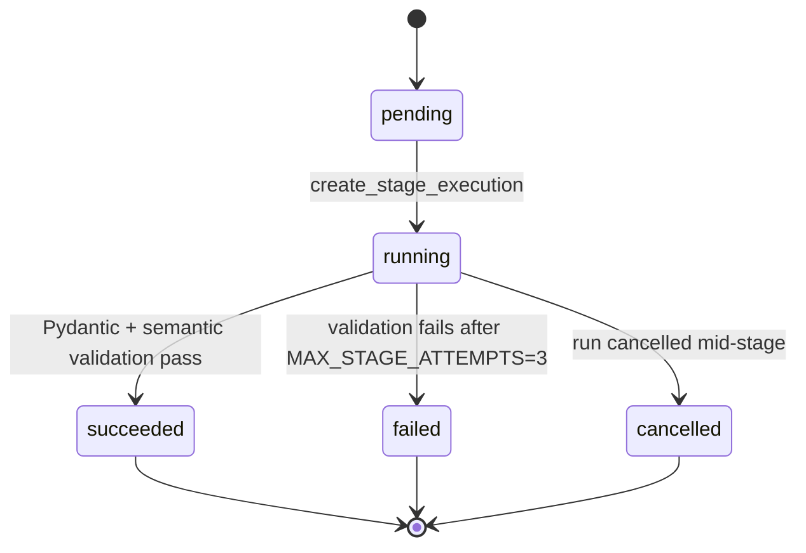
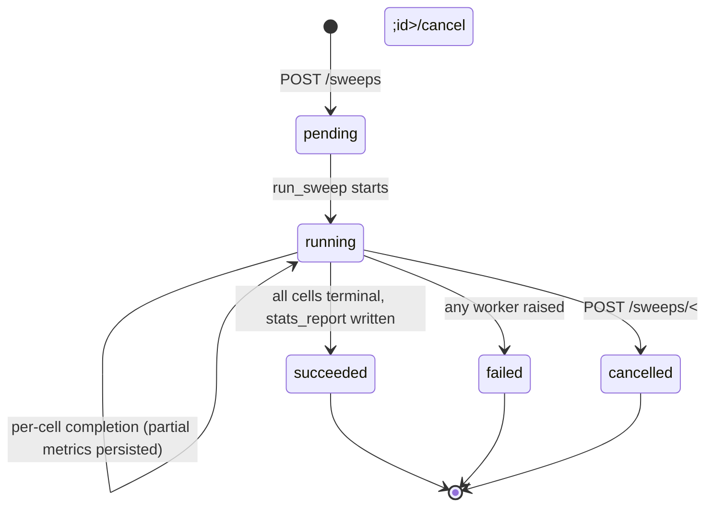
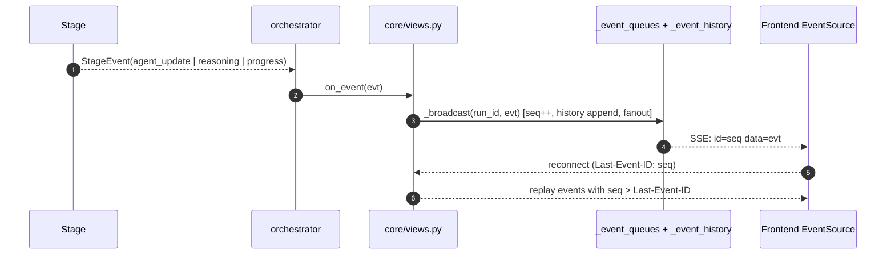

# ReqLens Backend — Architecture Report

Project: **ReqLens** (Django 5.x backend in `backend/`).
Scope: every Python module under `backend/` excluding `.venv`, migrations, and tests.
Source of truth: `backend/core/`, `backend/pipeline/`, `backend/eval/`, `backend/acp_client/`, `backend/reqlens/`.

---

## 1. One-paragraph summary

ReqLens is a **requirement-traced test generation tool**. The Django app exposes a thin REST + SSE API (`backend/core/`) that snapshots an immutable run config, then spawns a daemon thread which runs an **async pipeline orchestrator** (`backend/pipeline/orchestrator.py`). The orchestrator drives **six sequential stages** (`parse → analyze → map → generate → critique → trace`), each invoking an external coding agent through the **ACP runner** (`backend/acp_client/runner.py`). Each stage produces a Pydantic-validated artifact that nests the previous stage’s output. A **sweep runner** (`backend/eval/runner.py`) wraps the orchestrator to execute a matrix of `(agent, model, prompt strategy, context mode)` cells in parallel, then computes `metrics` and runs ANOVA/effect-size analysis (`backend/eval/stats.py`). Live progress fans out over **Server-Sent Events** with a per-stream replay buffer. A **BackgroundTask** heartbeat table lets `CoreConfig.ready()` reap orphaned runs after a process crash.

---

## 2. Directory layout (only what matters)

```text
backend/
├── manage.py                         entry point (cd backend && uv run python manage.py …)
├── pick_free_port.py                 dev helper
├── reqlens/                          Django project (settings, URL root, ASGI/WSGI)
│   ├── settings.py                   SQLite, DRF JSON-only, JSON logging, CORS
│   └── urls.py                       /api/v1/ → core.urls, /admin/ → Django admin
├── core/                             ← HTTP / persistence / SSE / supervision
│   ├── models.py                     Project, AgentConfig, Run, StageExecution, Sweep, BackgroundTask
│   ├── views.py    (887 LOC)         REST endpoints + SSE pub/sub + sweep matrix expansion
│   ├── urls.py                       /agents, /projects, /runs, /sweeps, /fs/validate
│   ├── serializers.py                DRF serializers for the above
│   ├── apps.py                       CoreConfig.ready() → reap_stale_background_tasks()
│   ├── background.py                 heartbeat helpers + reaper
│   └── admin.py                      Django admin registrations
├── pipeline/                         ← orchestration + stage logic + LLM-facing helpers
│   ├── orchestrator.py (659 LOC)     run_pipeline(run_id) — sequential stage driver
│   ├── stages/__init__.py            STAGE_ORDER, STAGE_CLASSES
│   ├── stages/base.py                Stage ABC, StageContext, StageEvent, JSON extraction
│   ├── stages/parse.py
│   ├── stages/analyze.py
│   ├── stages/map_stage.py           uses pipeline.retrieval (FAISS+BM25)
│   ├── stages/generate.py
│   ├── stages/critique.py
│   ├── stages/trace.py
│   ├── contracts.py                  Pydantic schemas (strict, extra=forbid) — chain of nested outputs
│   ├── prompts.py                    PROMPT_STRATEGIES dict (zero_shot / cot / few_shot_static / few_shot_dynamic)
│   ├── few_shot_examples.py          static + dynamic example library
│   ├── context_modes.py              build_context(mode, …) — minimal/local/module/full
│   └── retrieval.py                  hybrid FAISS + BM25 retriever (graceful degrade)
├── acp_client/                       ← outbound LLM agent calls
│   ├── registry.py                   ACP_AGENTS dict: claude-code, codex, cursor, gemini, opencode, kiro, blackbox, qwen-coder
│   ├── runner.py    (681 LOC)        run_acp_prompt() — spawns CLI, ACP session, mock fallback
│   ├── permissions.py                in-memory Future-based human-in-the-loop approvals
│   └── cursor_sdk/                   alternative runner path for Cursor ACP
├── eval/                             ← benchmarking + metrics + statistics
│   ├── runner.py    (450 LOC)        sweep matrix executor (concurrency-bounded)
│   ├── direct_baseline.py            single-pass ACP baseline used as the “floor”
│   ├── metrics.py                    compute_metrics(run_data) → quality / cost / coverage rollups
│   └── stats.py                      ANOVA + Welch t-tests + Bonferroni + Markdown report
└── data/                             SQLite db, run artifacts, log file
    └── runs/<run_id>/                per-stage JSON outputs
```

LOC totals (production code, excluding tests/migrations/venv): **~6,300 LOC** across 39 files, dominated by `core/views.py` (887), `acp_client/runner.py` (681), `pipeline/orchestrator.py` (659), `stats.py` (476), `eval/runner.py` (450).

---

## 3. Architecture graph (high-level)



---

## 4. Stage-by-stage dataflow



Key contract: each stage’s `Output` model **nests the previous stage’s output** (`AnalyzeOutput.parse: ParseOutput`, `MapOutput.analyze: AnalyzeOutput`, …). This gives every stage full provenance without separate lookups. `pydantic ConfigDict(strict=True, extra="forbid")` rejects malformed agent JSON.

The orchestrator additionally enforces **semantic** validation in `_validate_stage_output()`:
- `parse` must produce ≥1 requirement.
- `map` must include exactly one mapping per parsed requirement.
- `generate` must produce a test for every mapped requirement.
- `critique` must score every generated test file.
- `trace` must include one row per requirement; `covered`/`partial` rows must list `test_files`.

A failure here triggers the orchestrator’s retry loop (`MAX_STAGE_ATTEMPTS = 3`) before marking the run failed.

---

## 5. Lifecycle of a single run (HTTP → SSE)

```mermaid
sequenceDiagram
    autonumber
    participant FE as Next.js
    participant V as core/views.py
    participant DB as SQLite
    participant T as Daemon thread
    participant O as pipeline.orchestrator
    participant S as Stage (parse/analyze/…)
    participant R as acp_client.runner
    participant AG as External agent CLI

    FE->>V: POST /api/v1/projects/&lt;id&gt;/runs
    V->>DB: snapshot AgentConfigs → Run(config_snapshot)
    V->>T: threading.Thread(_run_in_thread, daemon=True)
    V-->>FE: 201 RunDetail (status=pending)
    FE->>V: GET /api/v1/runs/&lt;id&gt;/events  (EventSource)
    V-->>FE: SSE: replay buffer + live stream

    T->>O: asyncio.run(run_pipeline(run_id))
    O->>DB: register_background_task(kind=run, …)
    loop for stage in STAGE_ORDER
        O->>DB: StageExecution(status=running)
        O->>S: stage.run(ctx, previous_output, on_event)
        S->>R: run_acp_prompt(agent_id, model_id, system, user)
        R->>AG: spawn CLI + ACP JSON-RPC session
        AG-->>R: streamed updates + final response
        R-->>S: ACPResult(text, tool_calls, token_usage, raw_updates)
        S->>O: stage_output (Pydantic) + emit events
        O->>DB: StageExecution(status=succeeded, output_payload, tokens, latency)
        O-->>V: on_event(stage_completed) → _broadcast → SSE
    end
    O->>DB: Run(status=succeeded, finished_at)
    O-->>V: on_event(run_succeeded) → SSE
    O->>DB: finish_background_task(status=succeeded)
```

Notes:
- **No Celery / no broker.** Concurrency is plain daemon threads + asyncio inside each thread.
- **SSE pub/sub** lives in process memory (`_event_queues`, `_event_history`, `_event_seq` in `core/views.py`) protected by a `threading.Lock`. Per-key bounded ring buffer of 200 events allows replay via `Last-Event-ID`.
- **Cancellation** flips `Run.status` in DB; an `asyncio.create_task` cancel-watcher polling every 1s calls `task.cancel()`, which propagates into `acp_client/runner.py` to `terminate()` (then `kill()`) the agent subprocess.
- **Process restart safety:** `BackgroundTask` heartbeats every ~5s; on next startup `CoreConfig.ready()` calls `reap_stale_background_tasks()` to fail any task whose heartbeat is older than `STALE_AFTER = 5 min`. Restricted to server entry points (`runserver`, `uvicorn`, `gunicorn`, `daphne`) so management commands don’t trigger it.

---

## 6. Sweep lifecycle (matrix benchmarking)



The sweep runner:
- Materializes **all** runs up front (so the UI shows every cell as `pending` immediately).
- Holds a global **semaphore (default 4)** for concurrent runs (`SWEEP_MAX_CONCURRENCY`).
- Persists **partial** rankings after every completed cell (`persist_partial_metrics`) so the UI can update mid-sweep.
- Funnels per-cell events back through the same SSE channel under a `sweep-<sweep_id>` key.
- Uses an explicit `comparison_baseline` flag to designate the “floor” cell (`direct_acp_baseline · direct`) for `compute_baseline_diff`’s lift table.

---

## 7. Module responsibility table

| Layer | Module | Responsibility | Notable functions |
|---|---|---|---|
| **HTTP** | `reqlens/urls.py` | Routes `/api/v1/` to `core.urls`; `/admin/` to Django admin. | — |
| | `core/urls.py` | REST + SSE endpoint table. | — |
| | `core/views.py` | All endpoints, in-memory SSE pub/sub, sweep matrix expansion, daemon-thread launch. | `_broadcast`, `_subscribe`, `project_runs_create`, `sweeps_create`, `_expand_sweep_axes`, `run_events_stream`, `sweep_events_stream`, `run_cancel`, `run_permission_resolve` |
| | `core/serializers.py` | DRF serializers for Project/Run/Sweep/AgentConfig. | — |
| **Domain** | `core/models.py` | All ORM tables; `STAGE_CHOICES`, `PROMPT_STRATEGY_CHOICES`, `CONTEXT_MODE_CHOICES` enums. | `Project`, `AgentConfig` (unique `(project, stage)`), `Run`, `StageExecution`, `Sweep`, `BackgroundTask` |
| **Supervision** | `core/apps.py` | `CoreConfig.ready()` reaps stale background tasks at startup. | `ready()` |
| | `core/background.py` | Async heartbeat helpers + `reap_stale_background_tasks`. | `register_background_task`, `heartbeat_background_task`, `finish_background_task`, `reap_stale_background_tasks` |
| **Pipeline core** | `pipeline/orchestrator.py` | Async driver: load run → loop stages → write `StageExecution` → emit events → mark run terminal. Includes per-stage retry (`MAX_STAGE_ATTEMPTS=3`), Pydantic + semantic validation, cancel watcher. | `run_pipeline`, `_validate_stage_output`, `_parsed_requirement_ids`, `_merge_token_usage` |
| | `pipeline/stages/__init__.py` | `STAGE_ORDER` + `STAGE_CLASSES` registry. | — |
| | `pipeline/stages/base.py` | `Stage` ABC, `StageContext`, `StageEvent`, JSON extraction, `emit_acp_events`, `_extract_reasoning_chunks`. | `Stage.run` (abstract), `extract_json`, `emit_acp_events` |
| | `pipeline/stages/{parse, analyze, map_stage, generate, critique, trace}.py` | One concrete stage each. `map_stage.py` is the only one that touches `Retriever`. | `*Stage.run` |
| | `pipeline/contracts.py` | All Pydantic models. Each `Output` nests the previous stage’s output. | `Requirement`, `CodeSymbol`, `RequirementMapping`, `GeneratedTest`, `CritiqueScore`, `TraceRow`, `*Output` |
| | `pipeline/prompts.py` | `PROMPT_STRATEGIES[strategy][stage] -> template`. Fallback to `zero_shot`. | `get_prompt_template` |
| | `pipeline/few_shot_examples.py` | Static and dynamic few-shot example bank. | `get_static_examples`, `get_dynamic_examples` |
| | `pipeline/context_modes.py` | `build_context(mode, …)` → minimal/local/module/full. | `build_context` |
| | `pipeline/retrieval.py` | Hybrid FAISS + BM25 retriever; gracefully degrades if either lib is missing. | `Retriever.build_index`, `Retriever.search`, `Hit` |
| **LLM bridge** | `acp_client/registry.py` | `ACP_AGENTS` catalog (8 agents) with `AgentSpec`, `AuthMode`, `ModelGroup`. | `ACP_AGENTS` |
| | `acp_client/runner.py` | Spawns agent CLI, runs an ACP/JSON-RPC session, returns `ACPResult`. Mock fallback if SDK missing. Cursor-SDK alt path. | `run_acp_prompt`, `ACPResult`, `ACPError`/`Timeout`/`AgentNotFound`/`EnvMissing` |
| | `acp_client/permissions.py` | `_pending_permissions: dict[str, asyncio.Future]`; HITL approval with 5-min timeout. | `handle_permission_request`, `resolve_permission` |
| | `acp_client/cursor_sdk/` | Alternative runner path for Cursor’s SDK. | — |
| **Evaluation** | `eval/runner.py` | Sweep executor (matrix → runs → metrics → stats → report). Concurrency-bounded. | `run_sweep`, `_coerce_concurrency` |
| | `eval/direct_baseline.py` | Single-pass ACP “floor” — bypasses pipeline; locally parses requirements, runs one prompt, fakes minimal stage rows for metrics compatibility. | `run_direct_acp_baseline`, `_parse_requirements_document` |
| | `eval/metrics.py` | Per-run metrics rollup (traceability, strict coverage, critique accept, mapping confidence, FAISS evidence per mapping, generation coverage, stage success, latency, tokens, composite `quality_score`). | `compute_metrics`, `rank_metrics` |
| | `eval/stats.py` | One-way ANOVA per metric per axis; pairwise Welch t-tests with Bonferroni; Cohen’s d; Markdown report. | `run_statistical_analysis`, `compute_baseline_diff`, `generate_markdown_report` |

---

## 8. Strengths

1. **Clean layering.** HTTP/persistence (`core/`), pipeline orchestration (`pipeline/`), LLM transport (`acp_client/`), benchmarking (`eval/`) are clearly separated. Cross-layer imports are one-directional (`core ← pipeline ← acp_client`; `eval` sits to the side and reuses both).
2. **Strong typing on the hot path.** Every stage output is a Pydantic model with `strict=True, extra="forbid"`, and `_validate_stage_output()` adds **semantic** validation on top of schema validation. Bad agent output never silently propagates.
3. **Operability built in.** `BackgroundTask` heartbeats + reaper, cancel-watcher that propagates into agent subprocess termination, SSE replay buffer keyed by `Last-Event-ID`, JSON-formatted logs to file + console.
4. **Strategy/context as first-class axes.** `PROMPT_STRATEGY_CHOICES` × `CONTEXT_MODE_CHOICES` × `(agent_id, model_id)` is a real four-axis matrix, expanded in `_expand_sweep_axes` and executed in parallel by `eval/runner.py`. The benchmarking story is honest, not bolted on.
5. **Graceful degradation.** Retriever runs without `sentence-transformers` or `rank_bm25`; ACP runner returns a mock result if the SDK is missing; missing few-shot examples fall back to `zero_shot`.
6. **Stage I/O nesting** (`AnalyzeOutput.parse: ParseOutput`, etc.) gives any stage full upstream provenance without re-querying the DB. Useful for retries and for the trace stage’s final assembly.

---

## 9. Risks and weaknesses (with file:line pointers)

1. **Daemon-thread concurrency model.** Both `core/views.py:305` (`_run_in_thread`) and `eval/runner.py:218` start `threading.Thread(target=…, daemon=True)`. There is no worker queue, no retries on process crash beyond the heartbeat reaper, and no horizontal scale-out. Acceptable for a demo, but a single process is the whole production surface.
2. **In-memory SSE pub/sub.** `core/views.py:59` (`_event_queues`, `_event_history`, `_event_seq`) plus a `threading.Lock`. Multi-process WSGI/ASGI deployment (e.g. `gunicorn -w 4`) breaks this immediately — events broadcast in worker A are invisible in worker B. There is no Redis fallback.
3. **`core/views.py` is 887 LOC and mixes routing, SSE, sweep matrix expansion, and thread spawning.** `_expand_sweep_axes` (views.py:655) doing combinatorics belongs in `eval/`. The SSE machinery should be a separate module so it can be swapped (e.g. for a Redis-backed implementation).
4. **`test_pass_rate` and `line_coverage` are stubs** (`metrics.py:255-256`, hard-coded to `0.0`). The composite `quality_score` therefore weights 30%/20%/15%/15%/10%/5%/5% over **structural** signals only — no actual test execution. Until those land, claims of “quality” are claims about traceability and mapping, not behavior.
5. **`tokens_total` rollup is only as good as the agent.** `_merge_token_usage` (`orchestrator.py:87`) sums numeric leaves of any dict the agent reports, but in the recent sweep `cursor/composer-2[fast=true]` reported `tokens_total = 0` for every run — the “ΔTokens” column in lift tables is meaningless for that provider.
6. **Statistical anomaly rendering.** `_finite_float` (`stats.py:33-39`) silently converts `inf`/`nan` to `0.0`, so degenerate ANOVAs (zero within-group variance) render as `F=0.0000, p=0.0000, η²=1.000, ***`, which a reader cannot distinguish from a real result. `_eta_squared_magnitude` is computed even when `SS_total = 0` and the formula returns 0 — yet the table still shows 1.0 in some rows, indicating the `inf → 0` collapse on `F` is the only trace of the degenerate case. Should be flagged in the API and UI.
7. **Permissions store is in-memory and per-process** (`acp_client/permissions.py:32`). HITL approvals do not survive a restart and don’t fan out across workers.
8. **`pipeline/orchestrator.py` is 659 LOC** with many `@sync_to_async` shims defined inline inside `run_pipeline`. The function nests stage execution, retry, validation, token rollup, event emission, and DB updates. A clean refactor would extract `RunContext`, `StageRunner`, and `EventBridge` so the function reads as a 50-line driver.
9. **SQLite by default** (`reqlens/settings.py:127`). Fine for dev but SQLite plus daemon threads plus ACP I/O is a recipe for `database is locked` on long sweeps. There is a Postgres docker-compose service available; it should probably be the default in non-dev.
10. **No structured authentication.** All endpoints are open. `CORS_ALLOW_ALL_ORIGINS = DEBUG` is fine for local dev but the API has no auth layer at all.
11. **Retries are stage-level only.** `MAX_STAGE_ATTEMPTS = 3` (`orchestrator.py:45`) but a stage failure that *passes Pydantic* but fails semantic validation re-runs with the same prompt — there is no escalation strategy (e.g. switch to `chain_of_thought`, expand context).
12. **Mock-on-missing-SDK is silent.** `acp_client/runner.py` falls back to a mock response when the ACP SDK is not installed. Useful for testing, but the run looks `succeeded` to the orchestrator even though no real LLM was called. There is no “mock=true” marker in `StageExecution.token_usage` or `output_payload` to make this auditable.

---

## 10. Concrete recommendations

In rough priority order:

1. **Move SSE to a swappable bus.** Introduce `core/events.py` with an interface (`publish`, `subscribe`, `replay`) and two implementations: in-memory (current behavior) and Redis pub/sub + sorted-set replay buffer. Then `gunicorn -w N` becomes safe.
2. **Wire `test_pass_rate`.** Execute `GenerateOutput.tests` in a sandbox (e.g. ephemeral container) and read the JUnit/pytest results into `metrics.py`. This is the single biggest missing component.
3. **Split `core/views.py`.** Move sweep matrix expansion to `eval/matrix.py`, SSE plumbing to `core/events.py`, and the daemon-thread launcher to `core/jobs.py`. Targets: `views.py` ≤ 300 LOC.
4. **Refactor `run_pipeline`.** Extract a `StageRunner` with `prepare`, `execute`, `validate`, `persist`, `emit` phases; pull the `@sync_to_async` shims into a small repository class.
5. **Stamp mock invocations.** Add `mock: bool` to `ACPResult` and propagate to `StageExecution.token_usage["_mock"] = True`; surface in the UI badge.
6. **Fix degenerate ANOVA reporting.** When `SS_within == 0`, write `F = float("inf")` and a `note: "constant within groups; baseline-driven"` field; do not collapse to `0.0` and show `***`.
7. **Default to Postgres in non-dev.** Move SQLite to a `dev` settings flag; document that long sweeps under SQLite hit lock contention.
8. **Add minimum auth + CSRF on write endpoints.** Even token auth is enough for the demo; today every `POST /runs` is unauthenticated.
9. **Persist permission requests.** Move `_pending_permissions` to a small `PermissionPrompt` table so HITL flows survive restarts and multi-process deployments.
10. **Add an integration-level test that exercises a full pipeline** with the mock ACP path; right now stage validation is well-typed but there is no end-to-end smoke test asserting the SSE event sequence and metrics shape.

---

## 11. Five graphs you can paste into a deck

### 11a. Module dependency (one direction, no cycles)



### 11b. Run state machine



### 11c. Stage state machine (per `StageExecution`)



### 11d. Sweep state machine



### 11e. Event flow on the wire



---

## 12. Bottom line

The backend is a **well-typed, single-process, Django + asyncio choreography** of a six-stage LLM pipeline with a sound benchmarking layer on top. The strongest parts are the Pydantic + semantic stage validation, the operational details (heartbeats, reapers, SSE replay, cancel propagation into agent subprocesses), and the fact that prompt strategy and context mode are first-class axes rather than parameters buried in code. The weakest parts are concentration of state in a single process (SSE pub/sub, permissions, daemon threads, SQLite) and stub metrics that make `quality_score` a structural rather than behavioral score. Those are exactly the things to address before this becomes a multi-tenant or multi-process service.
