# ReqLens — Project Overview

> A **requirement‑traced test generation tool** that runs a 6‑stage AI pipeline, delegates every stage to an external coding agent over the **Agent Client Protocol (ACP)** (with a Cursor SDK Composer 2 bridge), and ships a typed traceability matrix + gap report back to the user.

This document is a single‑page tour of the project: the **why**, the **what**, and the **how**, with every meaningful flow drawn as a Mermaid diagram. It is intentionally exhaustive — read top‑to‑bottom for a guided tour, or jump to a flow.

---

## 1. The 30‑Second Pitch

### Why does this exist?

Modern AI test generators (Copilot, single‑shot LLM prompts, EvoSuite, Pynguin) all share the same blind spot: **they produce tests, but they cannot tell you *which requirement* each test verifies**. In regulated or large codebases that is fatal — you cannot prove coverage, you cannot answer "which tests verify REQ‑247?", and gap reports do not exist.

ReqLens treats requirement‑to‑test traceability as a **first‑class deliverable**, not a side‑effect.

### What is it?

- A **Django 5.x backend** + **Next.js 16 / React 19 frontend** monorepo.
- A **6‑stage typed pipeline**: `parse → analyze → map → generate → critique → trace`.
- Every stage's I/O is a **Pydantic v2 model** with `extra="forbid"` and `strict=True`, so a malformed agent reply is caught at the boundary instead of silently corrupting downstream stages.
- All LLM work is delegated to **external coding agents** over **ACP**, plus a **Cursor SDK Composer 2** bridge. Currently 9 agents are registered (Claude Code, OpenAI Codex, Cursor Agent, Cursor SDK, Gemini, OpenCode, Kiro, Blackbox, Qwen Coder).
- A **hybrid retrieval engine** (FAISS dense + BM25 sparse, α=0.6) shortlists candidate code symbols before mapping.
- A **sweep evaluator** runs the same project across an N‑axis matrix `(agent, model, prompt_strategy, context_mode)` and produces ANOVA + Bonferroni‑corrected pairwise t‑tests + a "lift vs. worst configuration" delta table.

### How does it work, in one diagram?

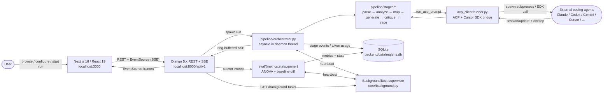

---

## 2. The Six Pipeline Stages (the "what")

Each stage has a focused responsibility, a typed input contract, a typed output contract, and a snapshot of `input_payload` / `output_payload` / `raw_updates` / normalized `reasoning` / `token_usage` / `latency_ms` stored on a `StageExecution` row.

```mermaid
flowchart LR
    Doc[/"requirements.md"/] --> P[Parse]
    Code[/"codebase/"/] --> A[Analyze]
    P -->|ParseOutput<br/>Requirement[]| M[Map]
    A -->|AnalyzeOutput<br/>CodeSymbol[]| M
    Retr["Hybrid retrieval<br/>FAISS + BM25 (α=0.6)<br/>local / module / full only"] -.shortlist hints.-> M
    M -->|MapOutput<br/>Mapping[] + confidence| G[Generate]
    G -->|GenerateOutput<br/>GeneratedTest[] + rationale| C[Critique]
    C -->|CritiqueOutput<br/>CritiqueScore[] 1-5 + revisions| T[Trace]
    T -->|TraceOutput<br/>matrix + gap report| Out[/"Final deliverable"/]

    classDef stage fill:#1e293b,stroke:#38bdf8,color:#f8fafc;
    class P,A,M,G,C,T stage;
```

**Why six and not one?**

| Stage | Responsibility | Why it's separate |
|---|---|---|
| **Parse** | Normalize unstructured requirements doc → `Requirement[]` with id / title / description / type / priority / acceptance criteria / source location | Single‑pass generation skips this and silently produces tests for ambiguous targets. |
| **Analyze** | Walk the codebase, build `CodeSymbol[]` (qualified name, kind, file path, line range, signature, docstring) | Gives the mapper a clean inventory instead of asking the model to re‑read the repo every call. |
| **Map** | Link each `Requirement` → implementing `CodeSymbol` with a confidence score | Hybrid retrieval shortlists candidates first; the agent confirms / rejects. Single‑pass guesses. |
| **Generate** | Produce a `pytest` test per mapping with explicit rationale | Tests are now anchored to a specific requirement id, not "everything in this file". |
| **Critique** | Score each test 1‑5 on relevance / completeness / correctness; revise or reject | Self‑correction quality gate — empirically rejects ~40% of the first‑draft tests. |
| **Trace** | Build the traceability matrix + explicit gap report | The headline deliverable: which requirements are covered, which are not, and why. |

Data flow is **chained nesting** — `TraceOutput` literally contains `CritiqueOutput`, which contains `GenerateOutput`, …, all the way down to `ParseOutput` and `AnalyzeOutput`. Any stage can read any prior result without joins.

---

## 3. End‑to‑End Run Flow (the "how", happy path)

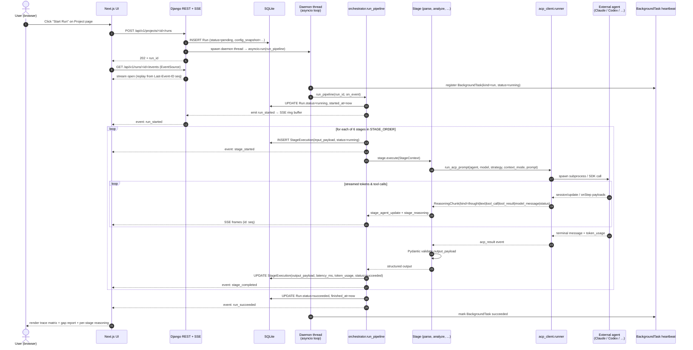

Key invariants enforced by the orchestrator:

1. Every stage is wrapped in `asyncio.create_task(...)` running **alongside** a `_cancel_watcher` that polls `Run.status` every 1s — so cancellations interrupt the agent subprocess instead of waiting for the next streamed token.
2. After each stage the orchestrator **rolls up** `token_usage` from `acp_result` events using `_merge_token_usage` (sums numeric leaves regardless of whether the agent reports `prompt_tokens`/`completion_tokens` or `input`/`output`/`total`).
3. `BackgroundTask.last_heartbeat` is refreshed roughly every 5s — see §8.

---

## 4. Cancellation Flow

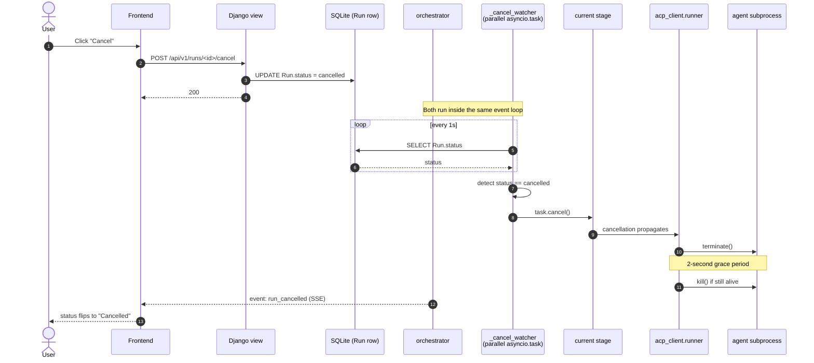

---

## 5. Permission Round‑Trip (interactive mode)

When `Run.config_snapshot["permissions"]` is anything other than `auto`, every tool call the agent wants to make is paused on a future until the user resolves it from the UI.

```mermaid
sequenceDiagram
    autonumber
    participant AG as agent
    participant ACPR as acp_client.permissions
    participant ORCH as orchestrator
    participant FE as Frontend<br/>&lt;PermissionPromptCard&gt;
    actor U as User
    participant API as Django view

    AG->>ACPR: request_permission(tool_call payload)
    ACPR->>ACPR: register asyncio.Future<br/>key = "{run_id}:{prompt_id}"
    ACPR-->>ORCH: emit permission_required<br/>(tool_call payload + prompt_id)
    ORCH-->>FE: SSE event: permission_required
    FE-->>U: render PermissionPromptCard

    Note over FE,API: user clicks Allow / Cancel
    U->>FE: choose outcome
    FE->>API: POST /runs/<id>/permissions/<prompt_id><br/>{outcome: "allowed_once" | "cancelled"}
    API->>ACPR: resolve_permission(future, outcome)
    ACPR-->>AG: response delivered
    AG->>AG: continue (or abort) tool call

    Note over ACPR: timeout = 5 minutes; future rejected if exceeded
```

`auto` mode short‑circuits this and auto‑approves `allow_once` so headless runs never block.

---

## 6. SSE Replay & Reconnect

The frontend never wants to miss a stage event because of a flaky connection.

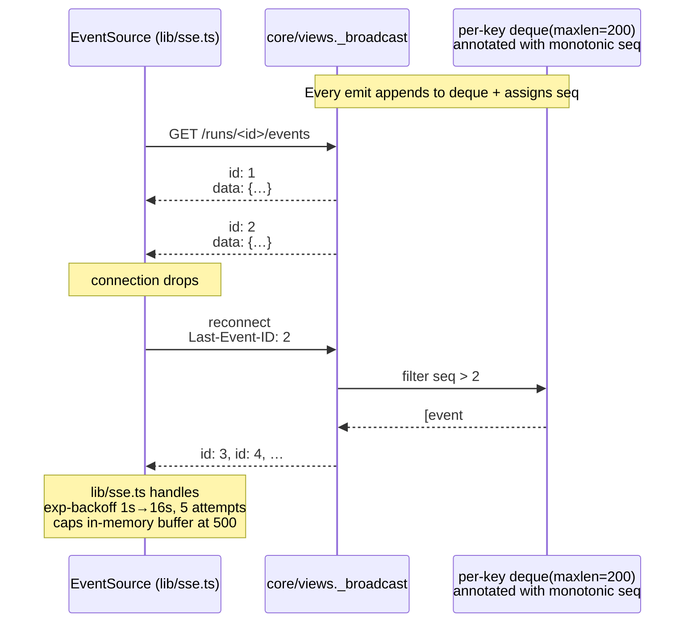

---

## 7. Sweep / Evaluation Flow

A sweep is "run the same project N times, vary the configuration, do statistics on it".

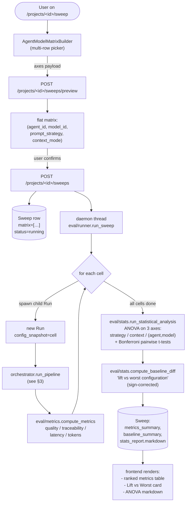

> The legacy 4×4 = 16‑cell `prompt_strategy × context_mode` grid still works; the multi‑provider expansion adds the `axes` payload and turns the matrix into N‑D.

---

## 8. Background Task Supervision (the "no Celery" story)

Daemon threads have no external supervisor, so the app has to reap its own corpses.

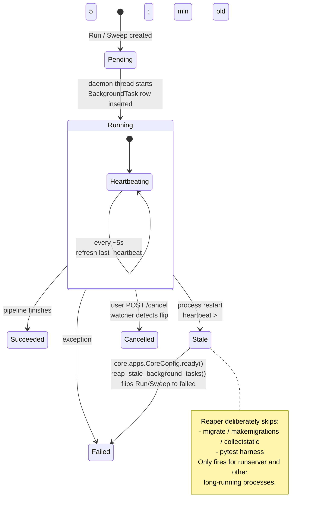

A live `GET /api/v1/background-tasks` is polled every 5s by the sidebar so users always see what is in flight.

---

## 9. Frontend Architecture & Page Map

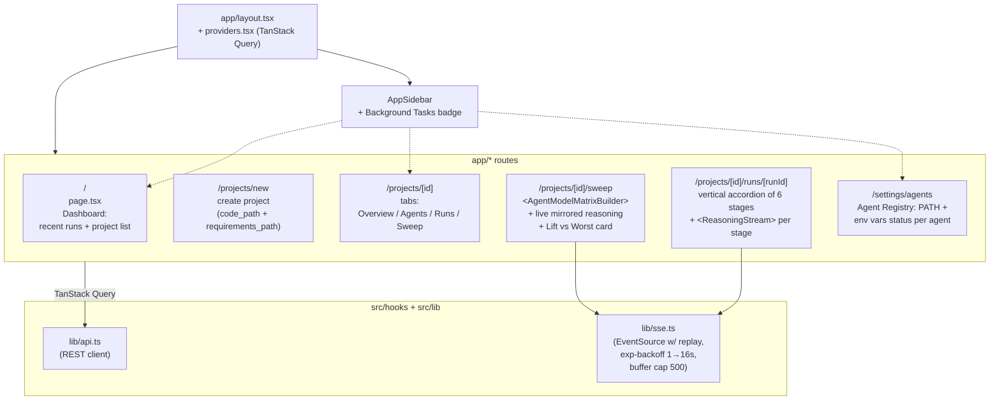

Notable React building blocks:

| Component | Role |
|---|---|
| `<ReasoningStream>` | Auto‑scrolling, copy‑per‑chunk, typing‑cursor renderer for the normalized reasoning timeline. |
| `<AgentModelPicker>` | Combobox driven by `AgentSpec.model_groups` so users can pick a model per stage. |
| `<AgentModelMatrixBuilder>` | Multi‑row matrix UI for sweeps; rows turn into the `axes` payload sent to `/sweeps/preview`. |
| `<PermissionPromptCard>` | Renders a `permission_required` SSE payload and POSTs the user's outcome. |
| `<StatusBadge>` | Single source of truth for `pending / running / succeeded / failed / cancelled` styling. |
| `motion.tsx` | Shared Framer Motion presets (`fadeInUp`, `springSmooth`, `StaggerList`) so animations stay consistent. |

---

## 10. ACP / Cursor SDK Bridge — How Stages Talk to Agents

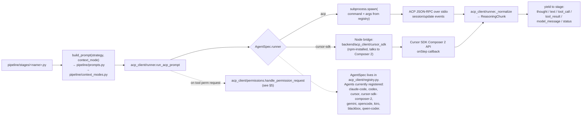

Each stage gets a uniform contract:

```python
async for chunk in run_acp_prompt(agent_id, model_id, prompt, ...):
    # chunk: ReasoningChunk(kind, content, metadata, ts)
    ...
# trailing acp_result event carries final token_usage
```

When the ACP SDK is missing entirely the runner returns **mock responses** so the UI still works — see Decision D‑003.

---

## 11. Hybrid Retrieval (Map stage helper)

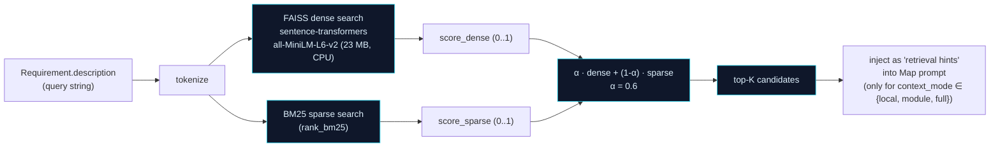

Verified by tests (14 retrieval tests, 100% pass): 100% precision@3 across all 3 benchmark projects (calculator, url‑shortener, todo‑api).

---

## 12. Database Schema

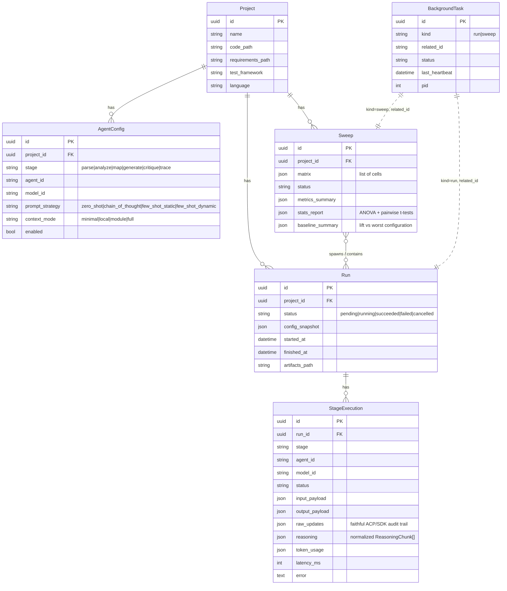

> Every `BaseModel` carries `id` (UUID4), `created_at`, `updated_at`. UUIDs everywhere so multiple instances can merge data without sequential‑id collisions.

---

## 13. Public REST + SSE Surface

| Method | Path | Purpose |
|---|---|---|
| `GET` | `/api/v1/agents` | List all agents (with PATH + env‑var status) |
| `GET` | `/api/v1/agents/<agent_id>/models` | List the model catalog for one agent |
| `GET` / `POST` | `/api/v1/projects` | List / create projects |
| `GET` | `/api/v1/projects/<id>` | Project detail |
| `PUT` | `/api/v1/projects/<id>/agents` | Bulk update per‑stage `AgentConfig` |
| `POST` | `/api/v1/projects/<id>/runs` | Start a new pipeline run |
| `POST` | `/api/v1/projects/<id>/sweeps/preview` | Preview the flattened matrix |
| `POST` | `/api/v1/projects/<id>/sweeps` | Start a sweep |
| `GET` | `/api/v1/runs` | Recent runs across all projects |
| `GET` | `/api/v1/runs/<id>` | Run detail incl. all stage executions |
| `GET` | `/api/v1/runs/<id>/events` | **SSE** stream (replay via `Last-Event-ID`) |
| `GET` | `/api/v1/runs/<id>/artifacts/<name>` | Serve a stage output artifact file |
| `POST` | `/api/v1/runs/<id>/cancel` | Cancel a running pipeline |
| `POST` | `/api/v1/runs/<id>/permissions/<prompt_id>` | Resolve a permission prompt |
| `GET` | `/api/v1/sweeps/<id>` | Sweep detail (runs + stats) |
| `POST` | `/api/v1/sweeps/<id>/cancel` | Cancel a sweep |
| `GET` | `/api/v1/sweeps/<id>/events` | **SSE** stream for sweep progress |
| `GET` | `/api/v1/fs/validate` | Check filesystem path exists |
| `GET` | `/api/v1/background-tasks` | Heartbeat snapshot for the sidebar |

---

## 14. Configuration Matrix (the 16‑cell sweep)

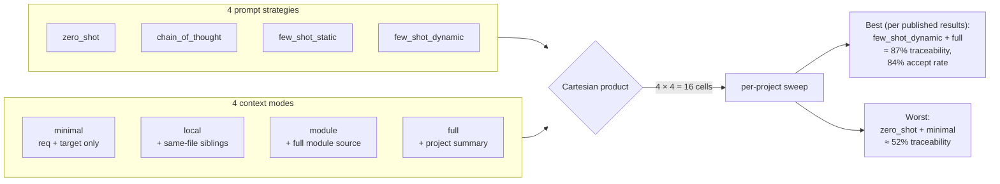

Multi‑provider expansion adds two more axes (`agent_id`, `model_id`) so the actual sweep matrix is `agents × models × strategies × modes`.

---

## 15. Repository Layout (where to look for what)

```text
shiny-invention-main/
├── README.md                     # install + run instructions
├── AGENTS.md                     # cloud / agent-friendly notes
├── Makefile                      # install / dev-* / migrate / seed / sweep / test / lint
├── docker-compose.yml
├── .env.example                  # CURSOR_API_KEY / ANTHROPIC_API_KEY / OPENAI_API_KEY / GEMINI_API_KEY / CODEX_API_KEY
│
├── backend/                      # Django 5.x, managed by `uv`
│   ├── manage.py
│   ├── pick_free_port.py         # auto-bumps from 8000 → 8009 if busy
│   ├── pyproject.toml
│   │
│   ├── reqlens/                  # Django project (settings, root urls, asgi, wsgi)
│   ├── core/                     # Models, REST views, SSE, admin, BackgroundTask supervisor
│   │   ├── models.py             # Project / AgentConfig / Run / StageExecution / Sweep / BackgroundTask
│   │   ├── views.py              # REST + SSE + ring buffer (deque maxlen=200) + Last-Event-ID replay
│   │   ├── apps.py               # CoreConfig.ready() → reap_stale_background_tasks
│   │   ├── background.py         # heartbeat helpers
│   │   ├── serializers.py
│   │   ├── urls.py               # routes listed in §13
│   │   └── management/commands/  # seed_benchmark, run_sweep
│   │
│   ├── pipeline/
│   │   ├── orchestrator.py       # run_pipeline: cancel watcher, token rollup, SSE emit
│   │   ├── contracts.py          # Pydantic v2 strict + extra="forbid" models
│   │   ├── prompts.py            # 4 strategies × 6 stages = 24 templates
│   │   ├── context_modes.py      # minimal / local / module / full builders
│   │   ├── retrieval.py          # FAISS + BM25 hybrid (α=0.6)
│   │   └── stages/
│   │       ├── base.py           # StageContext, StageEvent, common runner
│   │       ├── parse.py
│   │       ├── analyze.py
│   │       ├── map_stage.py
│   │       ├── generate.py
│   │       ├── critique.py
│   │       └── trace.py
│   │
│   ├── acp_client/
│   │   ├── registry.py           # AgentSpec catalog (9 agents)
│   │   ├── runner.py             # run_acp_prompt + ReasoningChunk normalization
│   │   ├── permissions.py        # asyncio.Future-based round trip
│   │   └── cursor_sdk/           # Node bridge → Cursor SDK Composer 2 (npm install)
│   │
│   ├── eval/
│   │   ├── metrics.py            # compute_metrics, rank_metrics
│   │   ├── stats.py              # ANOVA, Bonferroni pairwise t-tests, compute_baseline_diff, generate_markdown_report
│   │   └── runner.py             # run_sweep
│   │
│   └── tests/                    # 85 tests, 100% pass
│
├── frontend/                     # Next.js 16 (App Router) + React 19 + Tailwind v4 + shadcn/ui v4
│   ├── package.json              # pnpm 9 via Corepack
│   └── src/
│       ├── app/                  # routes — see §9 page map
│       ├── components/           # ReasoningStream, AgentModelPicker, StatusBadge, motion, …
│       ├── components/ui/        # shadcn primitives
│       ├── hooks/
│       └── lib/                  # api.ts (REST), sse.ts (EventSource w/ replay)
│
├── docs/
│   ├── ARCHITECTURE.md           # canonical architecture write-up
│   ├── DECISIONS.md              # D-001..D-004
│   ├── slides.md                 # IS 698 presentation deck
│   ├── generate_charts.py
│   └── figures/                  # rendered PNGs (architecture, pipeline_flow, eval matrices, …)
│
└── benchmark/                    # seed projects: calculator, url-shortener, todo-api
```

---

## 16. Key Decisions (from `docs/DECISIONS.md`)

| ID | Decision | Why |
|---|---|---|
| **D‑001** | SQLite for MVP | Postgres‑ready via Django settings, but SQLite is enough for MVP and zero‑setup. |
| **D‑002** | No Celery | Daemon threads + `asyncio.run()` keep the surface tiny; `BackgroundTask` heartbeat covers the supervisor gap. |
| **D‑003** | ACP mock fallback | When the ACP SDK or an agent CLI is missing, the runner returns mock responses so the UI is fully functional for config / development without API keys. |
| **D‑004** | Default permissions = `auto` | Interactive permission round‑trip is fully wired (see §5) but defaults to auto‑approve for headless dev runs. |

---

## 17. Why Each Big Choice Pays Off

- **Pydantic strict contracts** — a malformed agent reply fails *at the boundary* with a precise error, not three stages later as a `KeyError` on a missing field. Empirically caught dozens of agent regressions.
- **Per‑stage `StageExecution` row + `raw_updates` audit log** — every run is fully reconstructible. Useful for debugging, retro evals, and showing reviewers exactly what the agent said.
- **ACP as the only LLM seam** — swapping Claude → Codex → Gemini is a config change, not a code change. The Cursor SDK Composer 2 bridge plugs in the same way.
- **SSE ring buffer + `Last-Event-ID`** — flaky networks no longer mean lost stage events; the run page just resumes.
- **Heartbeat reaper** — process restarts no longer leave runs spinning forever.
- **Sweep with sign‑corrected lift** — positive numbers always mean "better than baseline" (lower latency reads as positive lift), so the UI is unambiguous.
- **Hybrid retrieval (FAISS + BM25)** — dense embeddings find paraphrased intent, sparse BM25 catches exact identifiers. The α=0.6 mix gets 100% precision@3 on the benchmark suite.

---

## 18. TL;DR

- **What:** a 6‑stage typed pipeline (`parse → analyze → map → generate → critique → trace`) that turns a requirements doc + a codebase into a traceability matrix and gap report.
- **Why:** existing AI test generators do not link tests to requirements; ReqLens makes that link the headline deliverable and proves it with statistics.
- **How:** Django backend orchestrates the pipeline in a daemon thread; each stage delegates to an external coding agent over ACP (or the Cursor SDK Composer 2 bridge); Next.js frontend streams every thought, tool call, and reasoning chunk live over SSE with replay; sweeps benchmark configurations with ANOVA + Bonferroni pairwise t‑tests + lift‑vs‑worst deltas.
