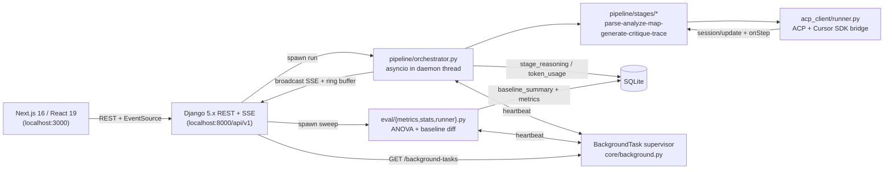

# Architecture

## System Overview

## Pipeline Stages

1. **Parse** — Extract requirements from document
2. **Analyze** — Walk codebase, build symbol inventory
3. **Map** — Map requirements to code symbols (FAISS+BM25 retrieval hints injected for `local`/`module`/`full` context modes)
4. **Generate** — Generate pytest tests for each mapping
5. **Critique** — Score tests on relevance/completeness/correctness
6. **Trace** — Build traceability matrix + gap report

Each stage:
- Snapshots its input as `StageExecution.input_payload` before invoking the agent
- Streams normalized `ReasoningChunk` events (kind ∈ `thought`, `text`, `tool_call`, `tool_result`, `model_message`, `status`)
- Emits an `acp_result` event after `run_acp_prompt` completes so the orchestrator can roll up `token_usage`

## Live UI Surfaces

- **Run page** ([frontend/src/app/projects/[id]/runs/[runId]/page.tsx](../frontend/src/app/projects/%5Bid%5D/runs/%5BrunId%5D/page.tsx)) — vertical accordion: each stage card expands to a `<ReasoningStream>` (auto-scrolling, copy buttons, typing cursor) plus the structured `output_payload`. Sub-stage progress combines completed-stage count, streamed reasoning event count, and a 1s heartbeat tick so the bar never freezes.
- **Sweep page** ([frontend/src/app/projects/[id]/sweep/page.tsx](../frontend/src/app/projects/%5Bid%5D/sweep/page.tsx)) — multi-row `<AgentModelMatrixBuilder>`; the active sweep run's reasoning stream is mirrored inline; "Lift vs Worst Configuration" card pulls deltas from `Sweep.baseline_summary`.
- **Sidebar** — live "Background Tasks" badge polled every 5s from `GET /api/v1/background-tasks`.

## SSE Replay Buffer

`core/views.py` keeps a per-key `deque(maxlen=200)` of broadcast events with monotonic `seq` ids. Each SSE message is sent with an `id:` header. On reconnect the EventSource sends `Last-Event-ID`; the server filters the deque so the client receives only events newer than the last seen seq. The frontend hook (`lib/sse.ts`) handles exponential-backoff reconnect (1s → 16s, 5 attempts) and caps the in-memory event buffer at 500 entries.

## Permissions

Auto mode auto-approves `allow_once` requests for headless runs. Any other mode (set via `Run.config_snapshot["permissions"]`) routes through `acp_client/permissions.handle_permission_request`, which:

1. Registers an `asyncio.Future` keyed `{run_id}:{prompt_id}`.
2. Broadcasts a `permission_required` SSE event with the tool-call payload.
3. Waits up to 5 minutes for the REST endpoint `POST /api/v1/runs/<run_id>/permissions/<prompt_id>` to resolve the future.
4. The frontend renders a `PermissionPromptCard` and POSTs `{outcome: "allowed_once"|"cancelled"}` when the user decides.

## Cancellation

The orchestrator wraps each stage in `asyncio.create_task(...)` and runs a parallel `_cancel_watcher` that polls `Run.status` once per second. When the row flips to `cancelled` the watcher calls `task.cancel()`; the cooperative cancellation propagates into the ACP runner where the agent subprocess receives `terminate()` (and `kill()` after 2s grace). Stages that don't stream `agent_update` events for long stretches are still interruptible.

## Background Task Supervision

Daemon threads have no external supervisor, so `core/background.py` keeps a `BackgroundTask` heartbeat row per active run/sweep. The orchestrator and sweep runner refresh the heartbeat every ~5 seconds. On Django startup, `core/apps.py:CoreConfig.ready()` runs `reap_stale_background_tasks()` which marks any heartbeat older than 5 minutes as `failed` and flips the related Run/Sweep accordingly — process restarts no longer leave runs spinning forever.

## Sweep Evaluation

Each sweep matrix entry is a `(agent_id, model_id, prompt_strategy, context_mode)` tuple. The legacy 16-cell strategy×context grid still works; the multi-provider expansion adds an axes payload (`POST /api/v1/projects/<id>/sweeps/preview`) that returns the flattened cells the server would actually run.

After every completed run the sweep runner persists:

- `metrics_summary` — ranked per-run metrics (quality_score, traceability, latency, tokens)
- `baseline_summary` — `compute_baseline_diff(ranked)` deltas vs. the worst-quality configuration. Lift is sign-corrected so positive always means "better than baseline" (positive `latency_total_ms` lift = lower latency, etc.).

When the sweep finishes, ANOVA runs across three axes — prompt strategy, context mode, and `(agent_id, model_id)` — with Bonferroni-corrected pairwise t-tests when ANOVA is significant. The Markdown report (`Sweep.stats_report.markdown`) embeds both the ANOVA tables and a "Lift vs Worst Configuration" table.

## Data Contracts

All pipeline stage I/O is typed with Pydantic v2 models in `pipeline/contracts.py`. Stage execution rows additionally store:

- `input_payload` — what the stage received from the previous stage
- `output_payload` — structured result
- `raw_updates` — original ACP/SDK payloads (faithful audit trail)
- `reasoning` — normalized `ReasoningChunk` timeline used by the UI
- `token_usage` — rolled up from `acp_result` events
- `latency_ms`
