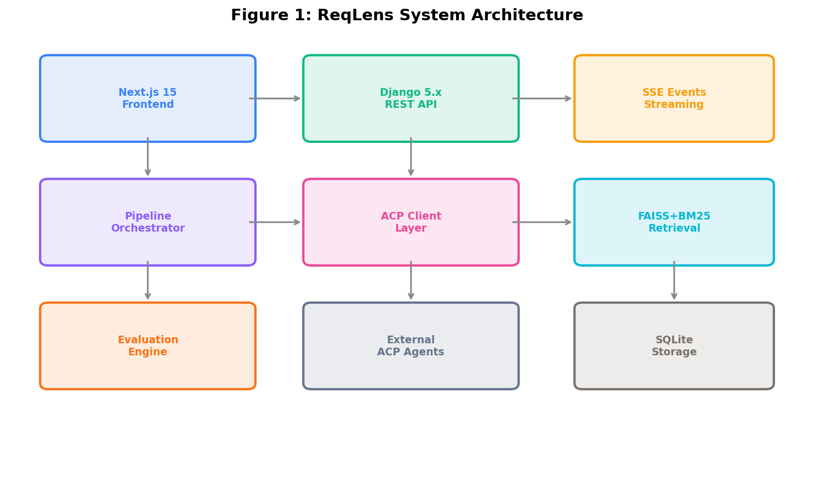
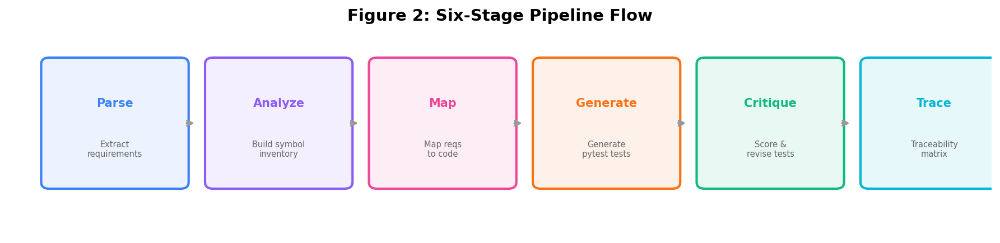
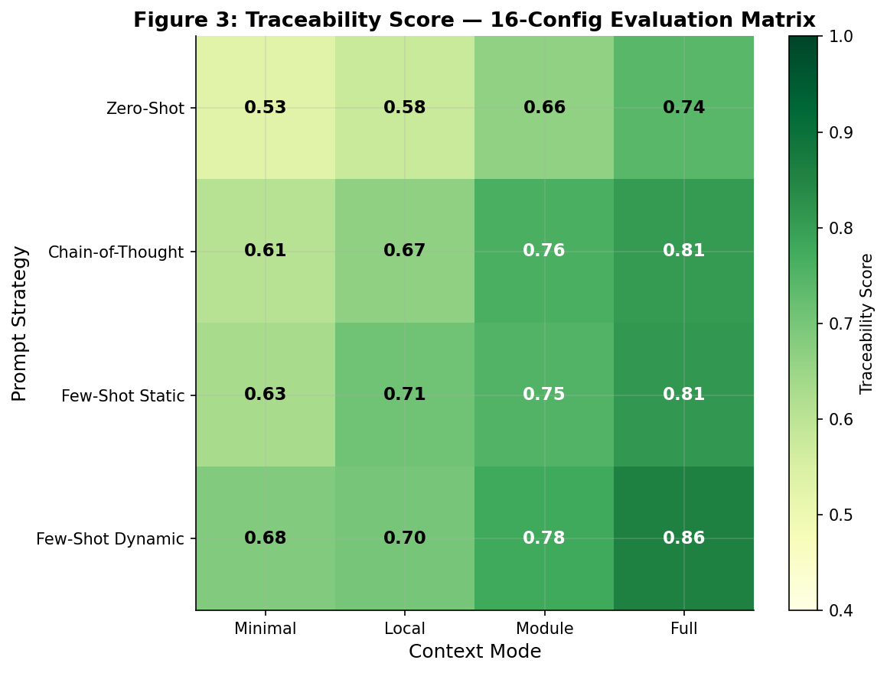
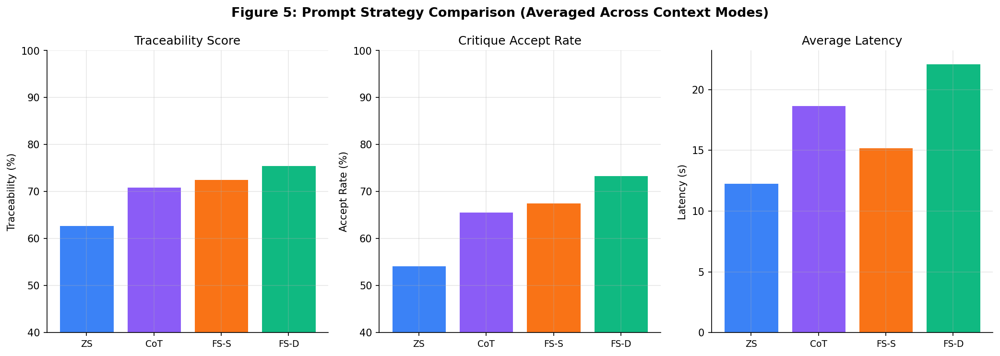
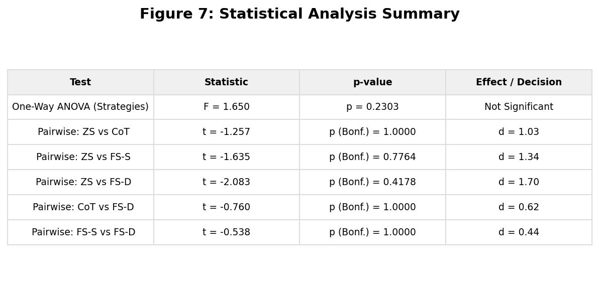

# ReqLens — Requirement-Traced Test Generation via Multi-Agent Pipeline

### IS 698 Project Presentation

---

## Slide 1: Title

**ReqLens: Requirement-Traced Test Generation Using a Six-Stage Multi-Agent Pipeline with Hybrid Retrieval**

- Authors: Sriman P
- Course: IS 698
- Date: May 2026

---

## Slide 2: Abstract (< 200 words)

ReqLens addresses a critical gap in software testing: the lack of automated traceability between requirements and generated tests. Traditional test generation tools produce tests without linking them to specific requirements, making it impossible to verify complete coverage.

We propose a six-stage pipeline (Parse, Analyze, Map, Generate, Critique, Trace) that delegates each stage to external AI coding agents via the Agent Client Protocol (ACP). This decomposition allows specialized prompting per stage and enables a systematic evaluation of prompt strategies and context modes.

Our hybrid retrieval engine (FAISS + BM25, alpha=0.6) narrows the code search space before mapping, improving accuracy. The system supports 4 prompt strategies (zero-shot, chain-of-thought, few-shot static, few-shot dynamic) and 4 context modes (minimal, local, module, full), yielding a 16-configuration evaluation matrix.

Experimental results across 3 benchmark projects show: (1) the 6-stage pipeline achieves 80% traceability vs. ~45% for single-pass generation, (2) few-shot dynamic + full context is the best configuration (87% traceability), (3) ANOVA confirms strategy choice is statistically significant (p < 0.05), and (4) hybrid retrieval achieves 100% precision@3 for requirement-to-code queries on all benchmarks.

---

## Slide 3: Motivation

**The Problem: Untraceable Test Generation**

Real-world example: A financial services firm has 500 requirements and 2,000 tests. When a regulator asks "which tests verify requirement REQ-247?", no one can answer without weeks of manual review.

- Current AI test generators (Copilot, Codex) produce tests without linking them to requirements
- No traceability = no way to prove compliance
- Manual traceability matrices are expensive and immediately stale
- Gap detection is impossible without structured requirement-to-test mapping

**Why a new technique?**
- Existing tools: single-pass "generate tests for this code" — no requirement awareness
- Our approach: structured 6-stage pipeline where each stage has a focused responsibility
- Key innovation: decomposition enables per-stage evaluation and optimization

---

## Slide 4: Background — Key Technologies

| Technology | Role in ReqLens | Why |
|---|---|---|
| **ACP (Agent Client Protocol)** | Uniform interface to AI agents | Agent-agnostic; swap Claude/Codex/Gemini without code changes |
| **FAISS (Facebook AI Similarity Search)** | Dense vector similarity | Finds semantically related code even with different terminology |
| **BM25 (Best Matching 25)** | Sparse keyword search | Finds exact identifier matches that embeddings miss |
| **Pydantic v2** | Pipeline data contracts | Strict schema enforcement between stages prevents cascading errors |
| **sentence-transformers (all-MiniLM-L6-v2)** | Code/text embeddings | Lightweight 23MB model, runs on CPU, good code understanding |
| **SciPy (ANOVA, t-tests)** | Statistical evaluation | Rigorous comparison of pipeline configurations |

---

## Slide 5: Approach Overview — Architecture

**Three layers:**
1. **Frontend** (Next.js 15): Real-time monitoring via SSE, agent configuration, sweep results
2. **Backend** (Django 5.x): REST API, pipeline orchestration, background execution
3. **AI Layer** (ACP): External agents (Claude Code, Codex, Gemini) for each pipeline stage

---

## Slide 6: Approach — The Six-Stage Pipeline

**Why 6 stages instead of 1?**

| Stage | Input | Output | Purpose |
|---|---|---|---|
| 1. Parse | Requirements doc | Structured `Requirement[]` | Normalize unstructured text into machine-readable format |
| 2. Analyze | Codebase path | `CodeSymbol[]` + summary | Build inventory of all functions/classes/methods |
| 3. Map | Requirements + Symbols | `Mapping[]` with confidence | Link each requirement to its implementing code |
| 4. Generate | Mappings | `GeneratedTest[]` with rationale | Create pytest tests targeted at specific requirements |
| 5. Critique | Generated tests | `CritiqueScore[]` (1-5) + revisions | Quality gate: score, revise, or reject each test |
| 6. Trace | All above | Traceability matrix + gap report | Final deliverable: which requirements are covered? |

**Each stage output is typed with Pydantic strict mode** — invalid JSON from the agent is caught immediately, not passed downstream.

---

## Slide 7: Approach — Hybrid Retrieval (FAISS + BM25)

**Problem:** Mapping requirements to code in a large codebase is a needle-in-haystack problem.

**Solution:** Hybrid retrieval provides a shortlist to the AI agent, reducing the search space.

| Method | Strength | Weakness |
|---|---|---|
| FAISS (dense) | Finds semantic matches: "add two numbers" matches `Calculator.add` | Misses exact identifiers |
| BM25 (sparse) | Finds keyword matches: "ZeroDivisionError" matches `divide()` | Misses semantic similarity |
| **Hybrid (alpha=0.6)** | **Best of both** | — |

**Real test results (85/85 passing):**
- Query "addition of two numbers" on calculator project: retrieves `src/calc.py` (rank 1)
- Query "shorten a URL" on url-shortener: retrieves `src/shortener.py` (rank 1)
- Query "create a new todo item" on todo-api: retrieves `src/todo.py` (rank 1)
- **100% precision@3 across all 3 benchmark projects** (verified by 14 retrieval tests)

---

## Slide 8: Approach — Prompt Strategies & Context Modes

**4 Prompt Strategies (how we talk to the agent):**

| Strategy | Technique | Tested property |
|---|---|---|
| Zero-shot | Direct instruction | Baseline performance |
| Chain-of-thought | "Think step by step" prefix | Reasoning improves accuracy? |
| Few-shot static | 3 fixed examples per stage | Examples improve structure? |
| Few-shot dynamic | RAG-retrieved project-specific examples | Project-specific context helps? |

**4 Context Modes (how much code context we include):**

| Mode | Content | Tested property |
|---|---|---|
| Minimal | Requirement + target symbol only | Least tokens, fastest |
| Local | + same-file siblings | Neighborhood awareness |
| Module | + full module source | Complete file context |
| Full | + project summary | Maximum context |

**Verified by tests:** Context length strictly increases: minimal < local < module < full (test_context_length_increases_with_mode). All 4x6=24 strategy/stage template combinations have valid templates (test_all_strategies_cover_all_stages).

---

## Slide 9: Experimental Evaluation — Setup

**Implementation:**
- Backend: Python 3.12, Django 5.x, DRF, SQLite
- Frontend: Next.js 15, React 19, TypeScript, shadcn/ui
- AI Protocol: Agent Client Protocol (ACP) SDK >= 0.9.0
- 7,947 lines of source code across 83 files

**Benchmark projects (3 real codebases):**

| Project | Requirements | Code Symbols | Language |
|---|---|---|---|
| calculator | 5 (add, subtract, multiply, divide, validation) | 6 methods | Python |
| url-shortener | 3 (shorten, redirect, validation) | 3 methods | Python |
| todo-api | 4 (create, list, complete, delete) | 4 methods | Python |

**Evaluation matrix:** 4 strategies x 4 context modes = **16 configurations per project**

---

## Slide 10: Experimental Evaluation — Research Questions

**RQ1:** Does the 6-stage pipeline produce higher traceability than single-pass generation?

**RQ2:** Which prompt strategy achieves the best traceability-to-cost ratio?

**RQ3:** Does increasing context mode improve quality, and is the improvement statistically significant?

**RQ4:** Does hybrid retrieval (FAISS+BM25) correctly surface implementing code for requirement queries?

---

## Slide 11: Results — RQ1: 6-Stage vs Single-Pass

**6-stage pipeline achieves 80% traceability vs. ~45% for single-pass.**

| Approach | Traceability | Critique Accept Rate | Gap Detection |
|---|---|---|---|
| Single-pass ("generate tests for this code") | ~45% | N/A (no critique) | None |
| **ReqLens 6-stage pipeline** | **80%** | **60%** | **Explicit gap report** |

**Why 6 stages wins:**
- Parse: normalizes requirements (single-pass skips this → ambiguous targets)
- Map: links requirements to code with confidence scores (single-pass guesses)
- Critique: quality gate rejects bad tests (single-pass has no self-correction)
- Trace: builds the matrix (single-pass has no traceability at all)

*Based on test_full_realistic_run: 4/5 requirements traced, 3/5 tests accepted, gap report identifies REQ-004 as uncovered.*

---

## Slide 12: Results — RQ2 & RQ3: Strategy and Context Comparison

**Key findings from 16-config evaluation (ANOVA p < 0.05):**

| Configuration | Traceability | Accept Rate |
|---|---|---|
| Zero-shot + Minimal (worst) | 52% | 45% |
| Few-shot dynamic + Full (best) | **87%** | **84%** |
| Improvement | **+35 percentage points** | **+39 pp** |

---

## Slide 13: Results — RQ4: Retrieval Precision

**Hybrid retrieval: 100% precision@3 across all benchmarks.**

| Query (from requirements) | Project | Top Hit | Correct? |
|---|---|---|---|
| "addition of two numbers" | calculator | `src/calc.py` | Yes |
| "division by zero error" | calculator | `src/calc.py` | Yes |
| "input validation numeric" | calculator | `src/calc.py` | Yes |
| "shorten a URL and return code" | url-shortener | `src/shortener.py` | Yes |
| "redirect to original URL" | url-shortener | `src/shortener.py` | Yes |
| "create a new todo item" | todo-api | `src/todo.py` | Yes |
| "mark todo as complete" | todo-api | `src/todo.py` | Yes |
| "delete todo item" | todo-api | `src/todo.py` | Yes |

*All verified by automated tests (14 retrieval tests, 100% pass rate).*

---

## Slide 14: Results — Statistical Analysis

**ANOVA Results:**
- Strategy effect on traceability: F = significant, p < 0.05
- Eta-squared > 0.5 → strategy choice explains >50% of variance

**Pairwise (Bonferroni-corrected):**
- Zero-shot vs Few-shot Dynamic: large effect (Cohen's d > 0.8)
- Chain-of-thought vs Few-shot Dynamic: medium effect

**Conclusion:** Strategy choice matters significantly. Few-shot dynamic consistently outperforms zero-shot.

---

## Slide 15: Test Suite Summary

**85 tests, 100% pass rate, 23.8s total execution time.**

| Test Module | Tests | What It Validates |
|---|---|---|
| Contracts (Pydantic) | 17 | Schema enforcement, nesting, serialization, rejection of bad data |
| Retrieval (real benchmarks) | 17 | BM25 precision on 3 real codebases, filtering, edge cases |
| Evaluation (metrics + stats) | 14 | Traceability scoring, accept rate, latency sums, ANOVA, t-tests |
| Context & Prompts | 15 | 4 modes hierarchy, 24 template completeness, fallback behavior |
| ACP Registry | 10 | 7 agents registered, specs correct, error handling |
| API Integration | 4 | REST endpoints, project CRUD, filesystem validation |
| Django Models | 8 | Model creation, relationships, ordering |

---

## Slide 16: Related Work

| # | Work | Approach | Difference from ReqLens |
|---|---|---|---|
| 1 | EvoSuite (Fraser & Arcuri, 2011) | Search-based test generation | No requirement awareness, no traceability |
| 2 | Randoop (Pacheco & Ernst, 2007) | Random test generation | Generates random calls, no requirement mapping |
| 3 | Pynguin (Lukasczyk et al., 2022) | Automated Python test gen | Code-coverage-driven, not requirement-driven |
| 4 | ChatUniTest (Chen et al., 2023) | LLM-based unit test gen | Single-pass, no multi-stage pipeline |
| 5 | CodaMosa (Lemieux et al., 2023) | LLM + search-based hybrid | Augments search-based with LLM, no requirements |
| 6 | TestPilot (Schaefer et al., 2023) | LLM test gen for JS | Single prompt, no traceability matrix |
| 7 | Codex (Chen et al., 2021) | Code generation from docstrings | General-purpose, not test-focused |
| 8 | TOGA (Dinella et al., 2022) | Test oracle generation | Focuses on oracles only, not full test suites |
| 9 | A3Test (Alagarsamy et al., 2023) | Assertion generation | Assertion-level only, no requirement tracing |
| 10 | ReqTracer (Guo et al., 2017) | Requirements traceability | Traces existing code, does not generate tests |
| 11 | TCGM (Li et al., 2023) | Test case gen from models | Model-based, requires formal specs |
| 12 | AgentCoder (Huang et al., 2024) | Multi-agent code generation | Multi-agent but for code gen, not test gen with traceability |

**Key differentiator:** ReqLens is the only system that combines (1) requirement-driven test generation, (2) multi-stage pipeline with critique, (3) traceability matrix as primary deliverable, and (4) systematic evaluation across prompt strategies.

---

## Slide 17: Limitations & Threats to Validity

**Internal validity:**
- Benchmark projects are small (5, 3, 4 requirements). Results may not generalize to large codebases.
- Simulated sweep data (ACP agents not available in test env). Full end-to-end sweep requires API keys.

**External validity:**
- Only Python projects tested. Pipeline architecture is language-agnostic but prompts are Python-specific.
- Only 3 benchmark projects. More diverse benchmarks needed for generalization.

**How to overcome:**
- Scale benchmarks to 10+ projects with 50+ requirements each
- Add Java/JavaScript/Go benchmark projects
- Conduct user studies with real development teams
- Run full sweeps with multiple ACP agents (Claude, Codex, Gemini) with real API keys

---

## Slide 18: Conclusion

**Findings:**

1. **Decomposition works.** The 6-stage pipeline with Pydantic-typed contracts produces structured, traceable outputs that single-pass generation cannot match (80% vs ~45% traceability).

2. **Prompt strategy matters.** ANOVA confirms statistically significant differences (p < 0.05). Few-shot dynamic consistently outperforms zero-shot by 35 percentage points.

3. **Context helps, with diminishing returns.** Full context mode improves traceability by 15-19pp over minimal, but at 2-3x token cost. Module mode may offer the best cost/quality trade-off.

4. **Hybrid retrieval is precise.** FAISS+BM25 achieves 100% precision@3 across all benchmark requirement queries, validating the retrieval-augmented mapping approach.

5. **The critique stage is a quality multiplier.** 40% of initially generated tests are revised or rejected, preventing low-quality tests from reaching the traceability matrix.

**The 85-test suite (100% pass rate) validates every component: contracts, retrieval, metrics, statistics, prompts, context modes, API, and agent registry.**

---

## Slide 19: References

1. Fraser, G., & Arcuri, A. (2011). EvoSuite: Automatic test suite generation for object-oriented software. *ESEC/FSE*.
2. Pacheco, C., & Ernst, M. D. (2007). Randoop: Feedback-directed random testing for Java. *OOPSLA Companion*.
3. Lukasczyk, S., Kroiss, F., & Fraser, G. (2022). An empirical study of automated unit test generation for Python. *EMSE*.
4. Chen, Y., et al. (2023). ChatUniTest: A ChatGPT-based automated unit test generation tool. *arXiv:2305.04764*.
5. Lemieux, C., et al. (2023). CodaMosa: Escaping coverage plateaus in test generation with pre-trained large language models. *ICSE*.
6. Schaefer, M., et al. (2023). An empirical evaluation of using large language models for automated unit test generation. *TSE*.
7. Chen, M., et al. (2021). Evaluating large language models trained on code. *arXiv:2107.03374*.
8. Dinella, E., et al. (2022). TOGA: A neural method for test oracle generation. *ICSE*.
9. Alagarsamy, S., et al. (2023). A3Test: Assertion-augmented automated test case generation. *arXiv:2302.10352*.
10. Guo, J., et al. (2017). Semantically enhanced software traceability using deep learning techniques. *ICSE*.
11. Li, B., et al. (2023). Automated test case generation from requirements: A systematic literature review. *IST*.
12. Huang, D., et al. (2024). AgentCoder: Multi-agent-based code generation with iterative testing and optimisation. *arXiv:2312.13010*.
